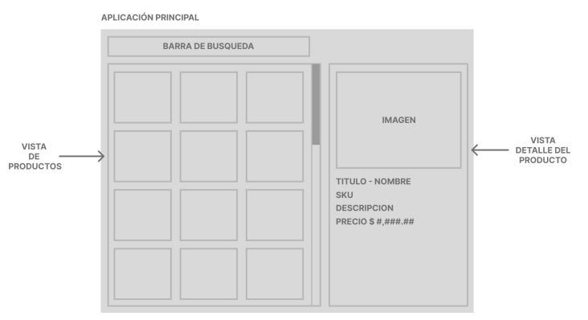
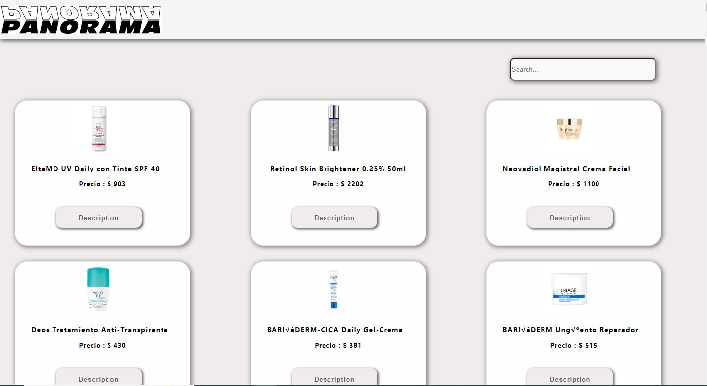
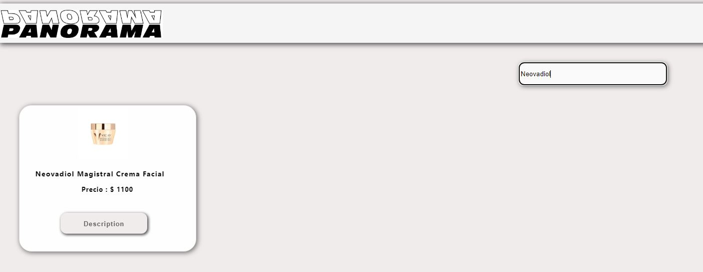
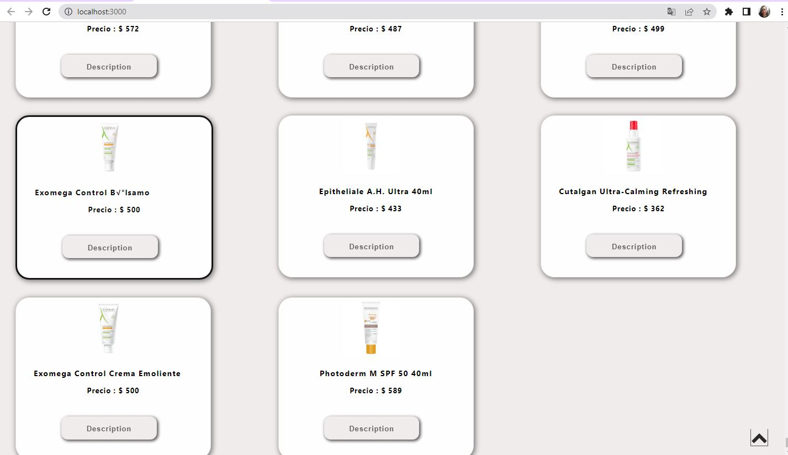

# 

## Índice

* [1. Definición del producto ](#1-definición-del-producto)
* [2. Diseño de la Interfaz de Usuario](#2-Diseño-de-la-Interfaz-de-Usuario)
* [3. Listado de las tecnologías o frameworks utilizados](#3-Listado-de-las-tecnologías-o-frameworks-utilizados)
* [4. Instrucciones detalladas de cómo instalar las dependencias y ejecutar el proyecto)](#4-Instrucciones-detalladas-de-cómo-instalar-las-dependencias-y-ejecutar-el-proyecto)
* [5. URL del repositorio git (Github, Gitlab, Bitbucket))](#5-URL-del-repositorio-git)

### 1. Definición del producto

Realizar una página web para una tienda en la línea.

En la página se mostrará un listado de productos disponibles en la tienda.

Características de aplicación:
+ Diseño single page.
+ Método de paginación a elección del desarrollador (Infinite scroll deseable).
+ Método de filtrado dinámico, al tener un grupo de caracteres o palabra mayor a 3 caracteres la vista de productos debe mostrar los resultados.
+ Al seleccionar un producto de la vista de producto sus características deben mostrarse sobre el componente correspondiente al detalle del producto.

### 2. Diseño de la Interfaz de Usuario

### Prototipo de baja fidelidad

### Prototipo de alta fidelidad

#### 3. Listado de las tecnologías o frameworks utilizados

Las tecnologías utilizadas en el presente proyecto son las siguientes:

1. HTML.
2. CSS.
3. JavaScript.
4. React JS.
5. React-scroll-up-button

##### 4. Instrucciones detalladas de cómo instalar las dependencias y ejecutar el proyecto

+ Crear una repositorio local.
+ Dar fork al repositorio [Interfaz](https://github.com/lylyzyta/P_works)
+ Crear un carpeta local.
+ Dar clone al proyecto en git.
+ Abrir carpeta local con visual studio code.
+ En terminal ingresar git clone https://github.com/lylyzyta/P_works.git
+ npm start.

##### 5. URL del repositorio git (Github, Gitlab, Bitbucket)
[Interfaz](https://github.com/lylyzyta/P_works)

